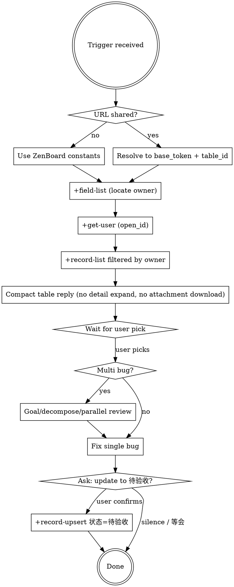

# Lark Bugs Assigned To Me

## Overview

When the user (1) shares a Lark/Feishu Base bug-pool URL, or (2) asks a verb-only question like "查看 bug" / "我的 bug" / "还有哪些任务待完成", the default move is to surface bugs **they own**, in a compact list, and **wait for them to pick** before touching code.

**Core principle:** scope-then-wait. Filter to the user's assignments. Show **every recorded text field** (复现步骤 / 预期 / 实际 / 复现环境 / 复现概率 / 前置条件 / 端 / 模块) so the user can triage in one read. **Do not** download or describe attachments — list the count only; download on explicit user request. Wait for the user to name a bug before changing any code.

## When to Use

Trigger on **any** of the following:

| Trigger | Example phrasing |
|---|---|
| Verb-only "show my bugs" intent | "查看 bug" · "我的 bug 列表" · "还有哪些任务待完成" · "看下 bug" · "what's on my plate" |
| Shared Lark/Base URL | `…/wiki/{token}?table=tbl…` or `/base/{token}?table=tbl…` whose linked table has owner + status + priority fields |
| Triage continuation | "下一条" · "still anything to fix?" · "再来一条" |

**Skip when:**
- User says "全部" / "show all" — they want unfiltered
- Shared Lark table is not a bug tracker (project list, contact roster…)
- User is creating/editing records, not triaging

## Project Bug Pool (ZenBoard)

**Hard-coded constants** for this project copy of the skill. When cloning into another repo, replace these four values and nothing else.

> **⚠ 注意 / Note**: 下面四个值是<占位符>, **不是**真实 token. 克隆这份 skill 到自己仓库后, 必须替换为你们 Lark Base 的实际地址 — 替换完成前, 触发"查看 bug"会直接失败.
> Replace the four `<YOUR_…>` placeholders below before first use, or the skill will fail at the wiki-resolve step.

```
WIKI_URL   = https://<YOUR_FEISHU_SUBDOMAIN>.feishu.cn/wiki/<YOUR_WIKI_TOKEN>?table=<YOUR_TABLE_ID>&view=<YOUR_VIEW_ID>
WIKI_TOKEN = <YOUR_WIKI_TOKEN>
TABLE_ID   = <YOUR_TABLE_ID>
VIEW_ID    = <YOUR_VIEW_ID>
```

If the user shares a *different* URL, override these for that invocation; default to the constants for verb-only triggers.

## Workflow

**REQUIRED SUB-SKILLS:**
- `lark-base` — wiki→base_token resolution, field/record listing, record updates
- `lark-contact` — current user identification



### Step 1 — Resolve URL → base_token + table_id

- Verb-only trigger → use the **ZenBoard constants** above directly. Skip wiki resolution; you already have the token.
- `/wiki/{token}?table=tbl…` shared → `lark-cli wiki spaces get_node --params '{"token":"<wiki_token>"}'`, use `data.node.obj_token` as base_token
- `/base/{token}?table=tbl…` shared → token is in the path
- `tbl…` from `?table=` → table_id; `vew…` from `?view=` → view_id (recommended)

### Step 2 — Read field schema, locate owner

```bash
lark-cli base +field-list --base-token <base_token> --table-id <table_id>
```

Find the **owner field** — name matches `责任人 / 负责人 / 指派人 / 经办人 / Assignee / Owner` AND `type == "user"`.

Note its **positional index** in the view's field order (record arrays are positional when `--view-id` is set).

If no owner-like field OR no status/priority field exists → not a bug pool → behave normally.

### Step 3 — Get current user open_id

```bash
lark-cli contact +get-user --as user 2>&1
```

Parse `data.user.open_id` on success, **or** extract `ou_[A-Za-z0-9_-]+` from a `need_user_authorization` error message. Cache for this session.

### Step 4 — List records, filter by owner

```bash
lark-cli base +record-list --base-token <base_token> --table-id <table_id> --view-id <view_id> --limit 200 --format json > /tmp/bugs.json
```

> Pagination caveat: `--limit 200` is one page. If the pool exceeds 200, records past the cutoff drop silently *before* filtering. If filtered count is 0 or suspiciously small, tell the user the pool may exceed 200.

Filter — owner field is a multi-person array of `{id, name}`:

```bash
# bun -e ...
const data = await Bun.file("/tmp/bugs.json").json();
const records = data.data.data;
const mine = records.filter(r => (r[OWNER_IDX] || []).some(o => o.id === ME));
```

### Step 5 — Report: index table + full text body, **no image download**

Sort by priority (P0 → P3). Output **both** of these:

**A. Index table** (always first, scannable):

| 编号 | 标题 | 优先级 | 状态 | 类型 | 端 | 复现概率 | 附件 |

**B. Per-bug detail block** for **every** bug in the list:

```markdown
### ZB-XXXX — <标题>

- **优先级 / 状态 / 类型 / 端 / 复现概率**: P1 严重 / 待分拣 / Bug / 桌面端 / 必现
- **前置条件**: <text or "—">
- **复现步骤**:
  <verbatim from record, preserve line breaks>
- **实际结果**: <text>
- **预期结果**: <text>
- **复现环境**: <text or "—">
- **附件**: 2 张截图 / 日志（**未下载**；要看说 "看 ZB-XXXX 的图"）
```

End with one line:

> 共 N 条待你修，另有 M 条不归你（已隐藏，需要全部列出请说"全部"）。挑一条说"改 ZB-XXXX"，要补背景就一起说。

**Forbidden in this reply:**
- ❌ Don't download attachments / screenshots (mention the count, that's it)
- ❌ Don't describe what's *in* the screenshot
- ❌ Don't proactively pick "我建议先修 ZB-XXXX" unless the user asked
- ❌ Don't start writing code or grepping the codebase

**Required in this reply:**
- ✅ Index table covering all assigned bugs
- ✅ Every text field above for every bug (so the user can decide on a single read without follow-up)
- ✅ If a record's field is empty, write `—` — don't omit the row, the absence itself is signal

Text fields are bounded (复现步骤 is usually 3-8 lines). 10-15 bugs × full text is the expected order of magnitude; don't elide.

### Step 6 — User picks → start fixing

The user already has the full text fields from Step 5. When they name a bug:

1. **Do not auto-download screenshots.** Only when the user explicitly says "看图" / "看一下图" / "看 ZB-XXXX 的截图" → download via the **Base attachment** path (see Quick Reference). Otherwise skip.
2. If the user supplies additional context (paths, narrower repro, scope hints), prefer their input over the recorded fields where they conflict.
3. Proceed with `superpowers:systematic-debugging` for the actual fix.

### Step 7 — Multi-bug fixes go through brainstorming first

If the user picks **multiple bugs** ("把 P0 全修了" / "ZB-0017 跟 ZB-0020 一起修"), do **not** start coding. First triage the work:

| Question | What to check | Output |
|---|---|---|
| **Goal sufficient?** | Do these N bugs collectively meet the user's intent, or is "全修 P0" actually a single regression frame? | If single regression, propose framing it as one fix |
| **Steps necessary?** | Are all N bugs distinct, or do some duplicate (look at `重复关联` field) / share the same root cause? | Collapse duplicates; flag shared-root candidates |
| **Smaller decomposition?** | Can each bug split into independently shippable PRs? Will splitting break feature cohesion (two bugs that touch the same code path should land together)? | Propose split or merge plan |
| **Parallel team feasible?** | Do bugs touch disjoint file sets? Any ordering deps (one fix changes infra used by another)? Does parallelism amortize cost vs sequential? | Decide sequential vs `dispatching-parallel-agents` |

**REQUIRED SUB-SKILLS for multi-bug:**
- `superpowers:brainstorming` — sanity-check goal + decomposition **before** writing code
- `superpowers:dispatching-parallel-agents` — when 2+ bugs touch disjoint files with no ordering dep
- `superpowers:subagent-driven-development` — when each bug needs an isolated plan/agent

**Default when uncertain:** sequential — highest priority first, commit, then re-evaluate. Parallelism overhead beats sequencing only when subtasks are truly independent.

### Step 8 — When the fix is in, ask first, then update the bug record

After implementation + tests/typecheck pass, **proactively ask the user**:

> ZB-XXXX 修复完成（tests/typecheck 通过）。要把状态改成"待验收"吗？

**Do not update the bug record before the user's explicit "yes"**. Acceptable confirmations:
- "改吧" / "改" / "确认" / "是" / "yes" / "好"
- "状态改成待验收" / "改为待验收" / "更新状态"
- "完成了" / "搞定" / "done"

Ambiguous answers ("先放着" / "等会" / silence) → do **not** update; bug record stays in current status.

When confirmed, run:

```bash
lark-cli base +record-upsert \
  --base-token <base_token> \
  --table-id <table_id> \
  --record-id <recordId> \
  --json '{"状态":"待验收"}'
```

`record-id` comes from `data.record_id_list[idx]` in the `--format json` (**no `--view-id`**) listing — positional arrays under `--view-id` don't carry IDs.

**Don't touch other fields without asking.** `修复说明` (one-line summary) and `PR/分支链接` are useful but the user owns them — explicitly ask:

> 顺便把"修复说明"填上吗？建议："<one-line summary of what changed>"。PR 链接还没开 PR，留空可以。

Only write those after a second explicit yes.

**Forbidden:**
- ❌ Updating status before asking
- ❌ Filling `修复说明` / `PR/分支链接` without asking
- ❌ Inferring confirmation from a topic shift ("接下来看下一条") — that's not consent to update **this** bug's status; re-ask if you intend to update before moving on

## Quick Reference

| Step | Command |
|---|---|
| Wiki → base_token | `lark-cli wiki spaces get_node --params '{"token":"..."}'` |
| Fields | `lark-cli base +field-list --base-token X --table-id Y` |
| Current user open_id | `lark-cli contact +get-user --as user 2>&1` (parse success **or** `need_user_authorization` error) |
| Records (filter source) | `lark-cli base +record-list --base-token X --table-id Y --view-id Z --limit 200 --format json` |
| Records with ids (for updates) | `lark-cli base +record-list --base-token X --table-id Y --limit 200 --format json` (no `--view-id` → `record_id_list` present) |
| Update bug status | `lark-cli base +record-upsert --base-token X --table-id Y --record-id R --json '{"状态":"待验收"}'` |
| Base attachment download (only when user asks for image) | `MSYS_NO_PATHCONV=1 lark-cli api GET "/open-apis/drive/v1/medias/<token>/download" --params @extra.json -o <file>` with `extra={"bitablePerm":{"tableId":"<table_id>","rev":0}}` |

## Common Mistakes

| Mistake | Fix |
|---|---|
| Treating verb-only trigger ("查看 bug") as "wait for URL" | Default to the ZenBoard constants above; don't ask the user for a URL |
| Dumping all records first, asking to filter later | Filter by owner **before** the first reply |
| Auto-downloading screenshots in the first reply | Skip attachments — list count only. Download only on "看图" / "看一下截图" |
| Eliding 复现步骤 / 实际 / 预期 to "save space" | Always include the full text fields per bug in Step 5; the user needs them to triage in one read |
| Describing what's in a screenshot you haven't downloaded | Just mention the attachment count; don't speculate about image content |
| Starting code change without explicit pick | Wait for "改 ZB-XXXX" or equivalent |
| Updating bug status to "待验收" without explicit user yes | After fix lands, **ask first** ("要把状态改成待验收吗？"); update only on confirmation. Silence ≠ yes. |
| Filling `修复说明` / `PR/分支链接` together with the status update | Those are separate questions — ask, then write |
| Multi-bug → start coding immediately | Route through `superpowers:brainstorming` first (goal/decomposition/parallel review table above) |
| Hardcoding open_id from a previous session | Always re-resolve via `+get-user --as user` |
| Treating owner field as scalar | It's an array — `any(.id === me)` for multi-assignee |
| Hardcoding "责任人" literal | Field name varies; read the schema |
| Drive `+download` for Base attachments | Returns HTTP 403; use the medias endpoint with `bitablePerm` extra param (Quick Reference) |
| Forgetting `MSYS_NO_PATHCONV=1` on Windows git-bash for `/open-apis/...` URLs | git-bash mangles the path; the env var disables conversion |

## Identity Resolution Rule

**Never hardcode the current user's name, open_id, or any Lark identifier in this skill or in memory.** Always resolve live via `+get-user --as user` at the start of each invocation. Identities rotate, sessions switch accounts, and a stale hardcoded id silently filters to the wrong person — the exact failure this skill exists to prevent.
